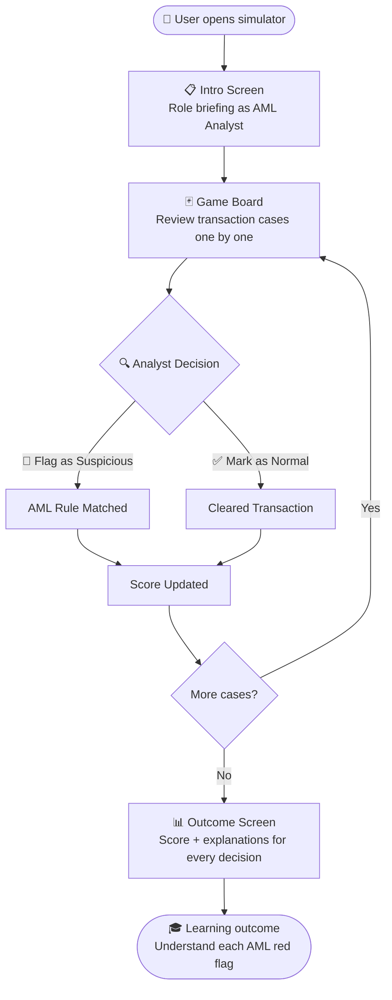
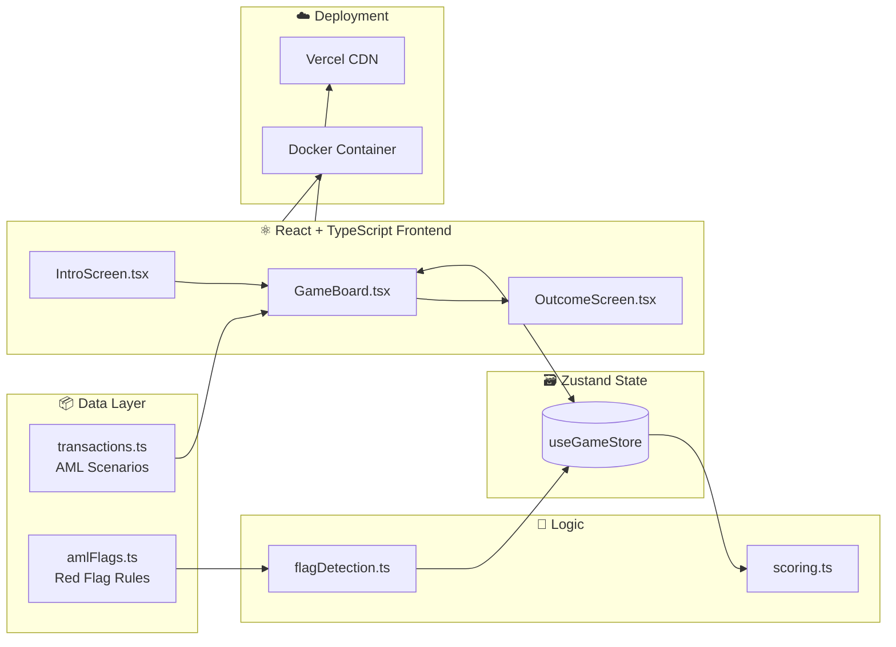
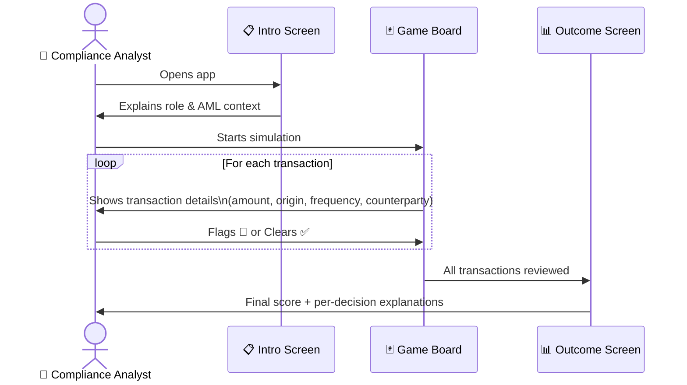

<div align="center">

# 🚨 AML Transaction Flagging Simulator

**Step into the shoes of an AML Compliance Analyst.**
Review real-world-style financial transactions. Spot the red flags. File your report.

[](https://aml-flagged-simulator.vercel.app/)
[](https://react.dev)
[](https://www.typescriptlang.org/)
[](https://vitejs.dev)
[](https://www.docker.com/)
[](https://vercel.com)
[](#)
[](#)

</div>

---

## 🗺️ How the Simulator Works — Visual Flow



---

## 🏗️ System Architecture



---

## 🚩 AML Red Flags Covered

| # | Red Flag | Description |
|---|----------|-------------|
| 1 | **Structuring / Smurfing** | Breaking large sums into smaller deposits to avoid reporting thresholds |
| 2 | **Rapid Movement of Funds** | Money transferred out immediately after deposit — layering pattern |
| 3 | **Unusual Transaction Patterns** | Activity inconsistent with a customer's profile or history |
| 4 | **High-Risk Jurisdiction Transfers** | Funds moving to/from FATF grey-listed or sanctioned countries |
| 5 | **Round-Dollar Transactions** | Suspiciously clean amounts (e.g. £10,000.00) with no business rationale |

---

## 🎮 User Journey — Three Screens



---

## 🛠️ Tech Stack

| Layer | Technology | Purpose |
|-------|-----------|----------|
| **Frontend** | React 18 + TypeScript | Component-based UI with full type safety |
| **Build** | Vite | Fast dev server & optimised production builds |
| **State** | Zustand | Lightweight global state management |
| **Styling** | CSS Modules | Scoped, maintainable component styles |
| **Container** | Docker + nginx | Portable deployment anywhere |
| **Hosting** | Vercel | Global CDN, instant deploys from GitHub |

---

## 📁 Project Structure

```
AML-Flagged-Simulator/
├── 📂 src/
│   ├── 📂 components/       # IntroScreen, GameBoard, OutcomeScreen
│   ├── 📂 data/             # Transaction datasets & AML scenarios
│   ├── 📂 store/            # Zustand state management
│   ├── 📂 styles/           # Global and component CSS Modules
│   ├── 📂 utils/            # Scoring logic & AML flag detection
│   ├── 📄 App.tsx           # Root component with stage routing
│   └── 📄 main.tsx          # App entry point
├── 📄 Dockerfile            # Container configuration
├── 📄 nginx.conf            # Production server config
├── 📄 package.json
└── 📄 vite.config.ts
```

---

## 🚀 Run Locally

```bash
# 1. Clone
git clone https://github.com/gogulashashank/AML-Flagged-Simulator.git
cd AML-Flagged-Simulator

# 2. Install & run
npm install
npm run dev
# → Open http://localhost:5173
```

## 🐳 Run with Docker

```bash
docker build -t aml-simulator .
docker run -p 8080:80 aml-simulator
# → Open http://localhost:8080
```

---

## 🎯 Why I Built This

I am actively pursuing a career in **AML Compliance and Financial Crime Prevention**. This project bridges the gap between theory and practice — translating knowledge from my **ICA Certificate in Anti-Money Laundering** into a working, deployable product that demonstrates:

- ✅ Real understanding of AML typologies and red flags
- ✅ Ability to build production-ready tools with React + TypeScript
- ✅ End-to-end ownership: design → build → containerise → deploy

---

## 📬 Contact

**Shashank Gogula** — MSc Business Analytics | AML & Compliance

[](https://www.linkedin.com/in/gogulashashank)
[](https://github.com/gogulashashank)

---

<div align="center">

*Built with React + TypeScript + Vite | Deployed on Vercel*

</div>
